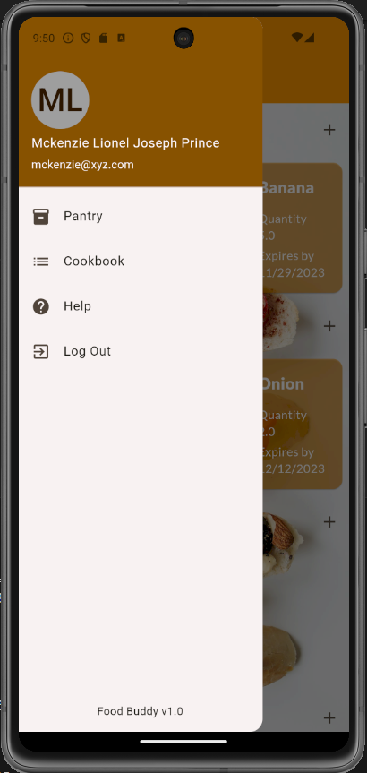
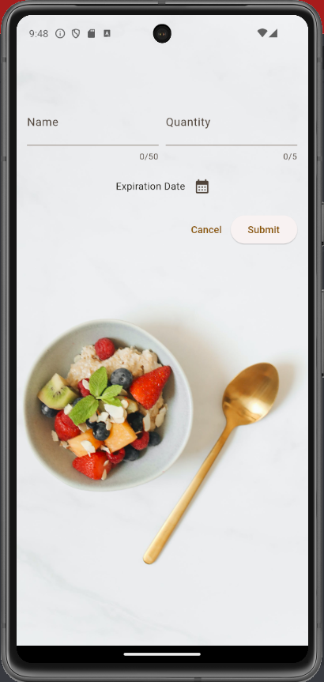
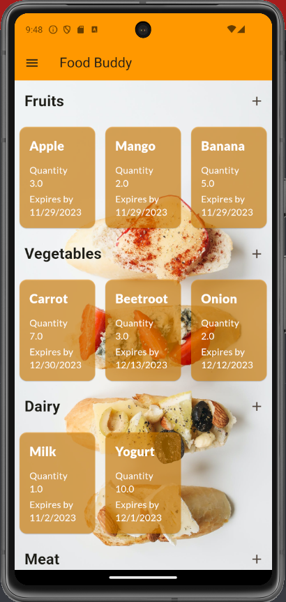

# Food Buddy


---

## Table of Contents

1. [About](#about)
2. [Application Preview](#application-preview)
3. [Getting started](#getting-started)
   - [Prerequisites](#prerequisites)
   - [Installation](#installation)
   - [Running the Application](#running-the-application)
4. [Development Specifications](#development-specifications)
5. [License](#license)
6. [Contributors](#contributors)


## About

## Dataset for ML
Raw dataset - https://www.kaggle.com/code/ipekgamzeucal/recipe-recommendation-based-on-ingredients
<br>
Filtered dataset - https://drive.google.com/drive/folders/1jEcOkRDdl2-WQ7KEnXwrv49H_R5Z1Huv?usp=drive_link


## Application Preview
General

### Demonstration Video
https://github.com/Mckenz31/foodBuddy/assets/101958689/d711ff4b-7c40-459d-9c7d-eeba5e0787f1


### 1. Frontend App - Flutter
### Recipes Home screen

### Recipes Input screen

### Recipes ItemList screen

<br><br>
### 2. Frontend Web App - React


### Recipes Home page


## Getting Started

### Prerequisites
Install the following dependencies

- [Python](https://www.python.org/downloads/) 3.12.0 (latest)
- [Django](https://docs.djangoproject.com/en/4.2/intro/install/) 4.2 or higher (latest)
- [Django Rest Framework](https://www.django-rest-framework.org/tutorial/quickstart/) (latest)
- [Flutter](https://docs.flutter.dev/get-started/install) (latest)
- [React](https://legacy.reactjs.org/docs/getting-started.html) (latest)
- [NextJS](https://nextjs.org/docs/getting-started/installation) (latest)
- [Material UI](https://mui.com/material-ui/getting-started/installation/) (latest)

### Installation
Step 1: Clone the repository through the terminal.

```
git clone <LINK>.git
```


Step 2: Set up Backend
```
cd foodBuddyBackend
pip install virtualenv
python<version> -m venv <virtual-environment-name>
source <virtual-environment-name>/bin/activate
pip install -r requirements.txt
```


Step 3: Setting up the Frontend 
```
pip install -r requirements.txt


```

Step 4: Setting up the Flutter
```
pip install -r requirements.txt
```

### Running the Application

Step 1: (Backend)
```
python manage.py makemigrations
python manage.py migrate
python manage.py runserver
```

Step 2: (Frontend)
```
(React)
cd foodBuddyFrontend
npm run dev

(Flutter)
flutter run
```


## Development Specifications


The above-mentioned technologies were used to develop the project.


## License

This project is licensed under [MIT](https://mit-license.org/).
Further details regarding the license can be found [here](https://github.com/Mckenz31/foodBuddy/LICENSE).

 
## Contributors

- [Mohit Soni](https://github.com/mohitsoni2111)
- [Mckenzie](https://github.com/Mckenz31)
- [Rucha Patil](https://github.com/RuePat)
- [Stephen](https://github.com/Steven-Tio)
